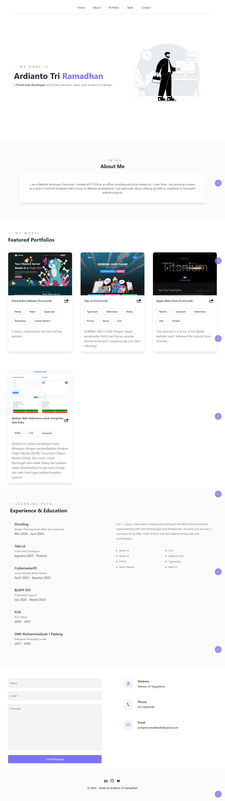

## Description

this is my personal website that uses the solidJs framework

```bash
$ git clone https://github.com/ardianto29/Porto-SolidJs.git

cd Porto-SolidJs

$ npm install # or pnpm install or yarn install
```

## Tech-Stack

- SolidJs
- TypeScript
- Tailwind CSS
- Framer Motion
- Lenis Scroll

### Learn more on the [Solid Website](https://solidjs.com) and come chat with us on our [Discord](https://discord.com/invite/solidjs)

## Available Scripts

In the project directory, you can run:

### `npm run dev` or `npm start`

Runs the app in the development mode.<br>
Open [http://localhost:3000](http://localhost:3000) to view it in the browser.

## Deployment

You can deploy the `dist` folder to any static host provider (netlify, surge, now, etc.)

## Display


